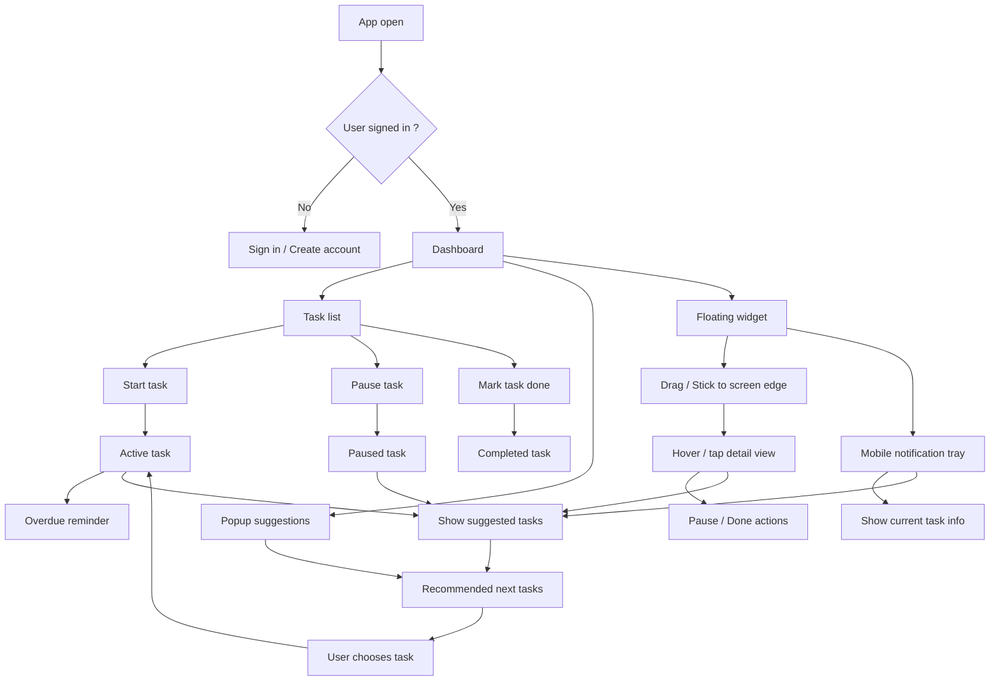

```mermaid
flowchart TD
    A[App open] --> B{User signed in ?}
    B -- No --> C[Sign in / Create account]
    B -- Yes --> D[Dashboard]
    D --> E[Task list]
    E --> F[Start task]
    E --> G[Pause task]
    E --> H[Mark task done]
    F --> I[Active task]
    G --> J[Paused task]
    J --> K[Show suggested tasks]
    I --> L[Overdue reminder]
    I --> K
    K --> M[Recommended next tasks]
    M --> N[User chooses task]
    N --> I
    H --> O[Completed task]
    D --> P[Popup suggestions]
    P --> M
    D --> Q[Floating widget]
    Q --> R[Drag / Stick to screen edge]
    R --> S[Hover / tap detail view]
    S --> T[Pause / Done actions]
    S --> K
    Q --> U[Mobile notification tray]
    U --> V[Show current task info]
    U --> K
```
