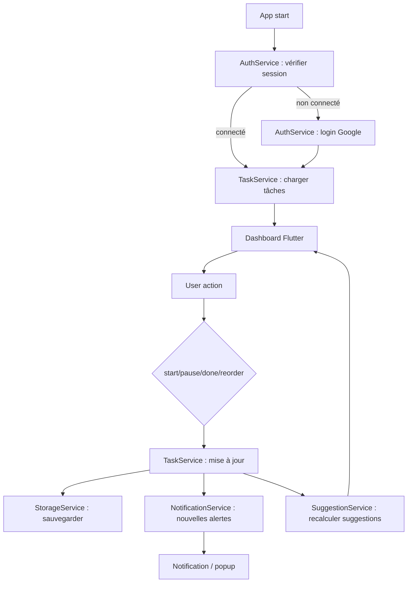
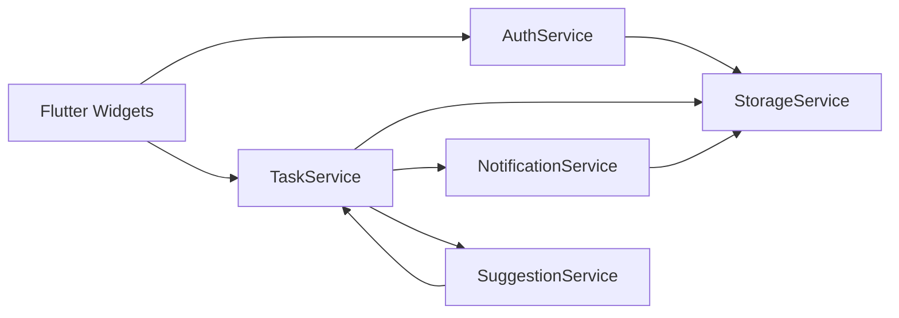

# noProcrasti - Architecture de développement

## Contexte
Ce document décrit le dataflow, les services existants et le comportement du code pour le développement de l'application noProcrasti, en conformité avec les normes du sujet : ISO/IEC 25010, PAQ, ITIL, CMMI.

## Architecture générale
- UI : Flutter Widgets
- Services métiers : AuthService, TaskService, NotificationService, SuggestionService
- Stockage : StorageService (local ou cloud)
- Gestion d'état : provider / Riverpod / Bloc
- Notifications : services locaux et comportement en arrière-plan

## Dataflow principal
1. L'utilisateur ouvre l'application.
2. L'application vérifie l'état de session via `AuthService`.
3. Si non connecté, l'utilisateur s'authentifie via email et mot de passe.
4. Après connexion, `TaskService` charge les tâches depuis le stockage.
5. Le tableau de bord s'affiche avec la liste des tâches ordonnées.
6. L'utilisateur démarre, met en pause ou termine une tâche.
7. `TaskService` met à jour le statut, l'ordre et la planification.
8. `NotificationService` planifie ou déclenche des rappels.
9. `SuggestionService` calcule les tâches recommandées et les gaps multitâche.

## Services existants
- `AuthService`
  - login/logout local
  - gestion de session
  - récupération des informations utilisateur

- `TaskService`
  - chargement et sauvegarde des tâches
  - création, modification, suppression
  - mise à jour de statut (active, paused, done)
  - réordonnancement des tâches
  - calcul de l’overdue et de l’attente

- `NotificationService`
  - notifications locales
  - rappels de retard
  - suggestions au moment d'une pause ou d'une fin de tâche

- `SuggestionService`
  - analyse des tâches en cours, en pause et programmées
  - détection de gap de 30 minutes
  - génération de recommandations de multitâche
  - gestion de l’option future AI

- `StorageService`
  - base Hive locale pour les tâches
  - `SharedPreferences` reste utilisé pour la session et les réglages
  - sérialisation / désérialisation des tâches et de l’utilisateur

## Comportement du code
- L'UI appelle des méthodes dans les services via un gestionnaire d'état.
- Chaque action utilisateur est une seule responsabilité : commencer, mettre en pause, terminer, réordonner.
- Les services renvoient des objets immuables ou des copies modifiées.
- Les effets secondaires sont gérés dans les services : stockage, notifications, suggestions.
- Les composants UI restent légers ; la logique métier est centralisée.

## Diagramme Mermaid - Dataflow


## Diagramme Mermaid - Services


## Diagramme Mermaid - Code flow pour une tâche
```mermaid
flowchart TD
    Dashboard[Dashboard screen]
    Dashboard --> Start[Start button pressed]
    Dashboard --> Pause[Pause button pressed]
    Dashboard --> Done[Done button pressed]
    Start --> TaskServiceUpdate[TaskService.updateStatus(active)]
    Pause --> TaskServiceUpdate[TaskService.updateStatus(paused)]
    Done --> TaskServiceUpdate[TaskService.updateStatus(done)]
    TaskServiceUpdate --> StorageUpdate[StorageService.save(task)]
    TaskServiceUpdate --> NotifyPlan[NotificationService.schedule(task)]
    TaskServiceUpdate --> SuggestRefresh[SuggestionService.refresh()]
    SuggestRefresh --> Dashboard
    NotifyPlan --> System[OS notification / tray]
```

## Conformité avec le sujet
- ISO/IEC 25010 : qualité fonctionnelle, performance, maintenabilité et compatibilité.
- PAQ : architecture documentée, services séparés, tests et validations possibles.
- ITIL : gestion des changements à travers les actions de tâche et notifications.
- CMMI : processus défini, couche de services, relectures et audit facilités.

## Utilisation
Ce fichier doit servir de base au développement Flutter et à la documentation d'architecture.
- Implémenter les services séparés.
- Faire correspondre chaque action utilisateur à un service.
- Garder les widgets UI simples.
- Conserver un dataflow clair pour les tests et l'audit.
