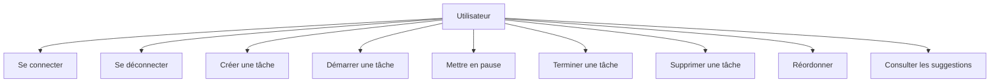
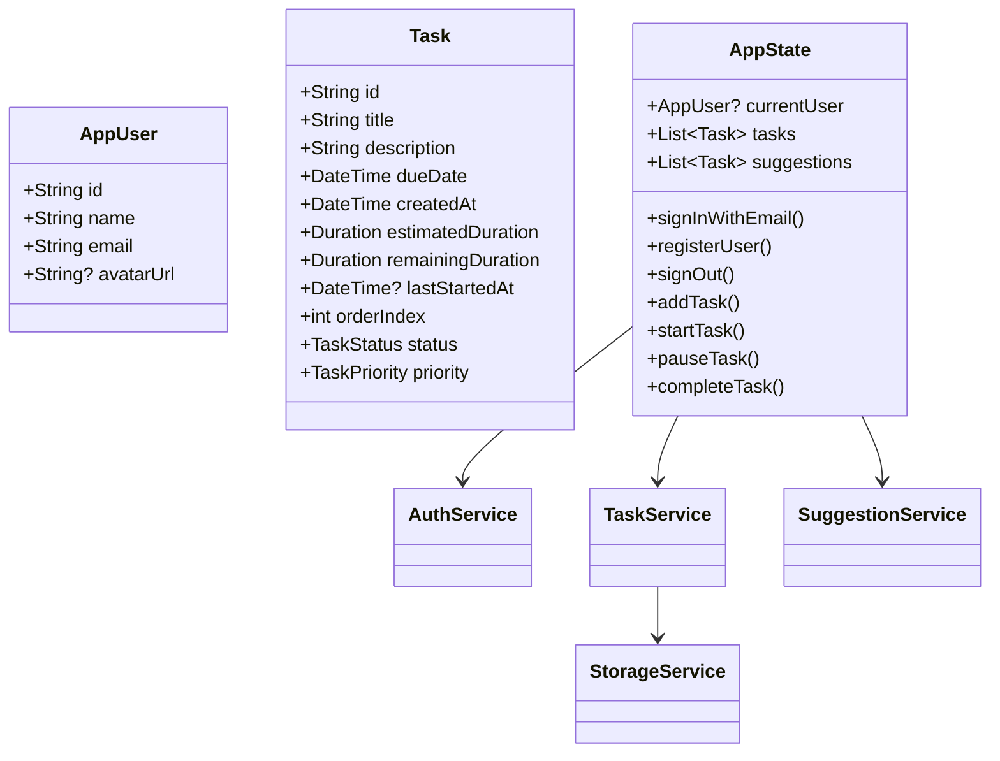
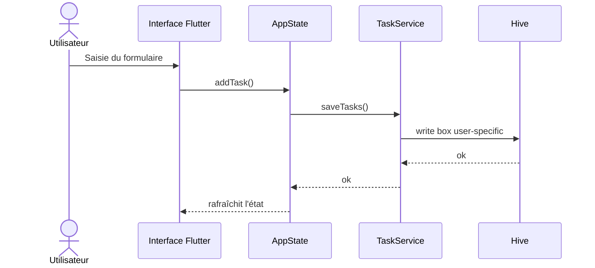

# Phase 2 - Conception

## 1. Architecture du système

Le système suit une architecture simple en couches :

- Présentation : widgets Flutter.
- État applicatif : `AppState`.
- Services : `AuthService`, `TaskService`, `StorageService`, `SuggestionService`, `NotificationService`, `SettingsService`.
- Données : Hive pour les tâches, SharedPreferences pour la session et les réglages.

## 2. Diagramme de cas d'utilisation

## 3. Diagramme de classes simplifié

## 4. Diagramme de séquence - création de tâche

## 5. Modèle de base de données

### Entité Task

| Champ | Type | Description |
|---|---|---|
| id | String | Identifiant unique |
| title | String | Titre |
| description | String | Description |
| dueDate | DateTime | Date d'échéance |
| createdAt | DateTime | Date de création |
| estimatedDuration | Duration | Durée estimée |
| remainingDuration | Duration | Temps restant |
| lastStartedAt | DateTime? | Dernier démarrage |
| orderIndex | int | Position dans la liste |
| status | TaskStatus | pending, active, paused, done |
| priority | TaskPriority | low, medium, high |

### Stockage

- Box Hive par utilisateur : `noprocrasti_tasks_<userId>`.
- Session utilisateur : SharedPreferences.
- Réglages : SharedPreferences.

## 6. Maquettes fonctionnelles

### Écran de connexion

- Champ email
- Champ mot de passe
- Bouton Login
- Lien vers création de compte

### Tableau de bord

- Bouton de déconnexion
- Bouton ajout de tâche
- Tâche active visible en premier
- Liste triée des tâches restantes
- Section tâches terminées
- Section suggestions

### Détail de tâche

- Titre
- Description
- Échéance
- Priorité
- Statut
- Actions Start / Pause / Done / Delete
